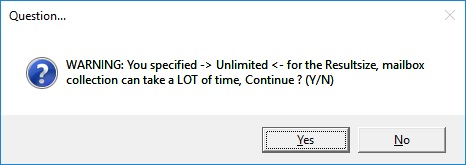
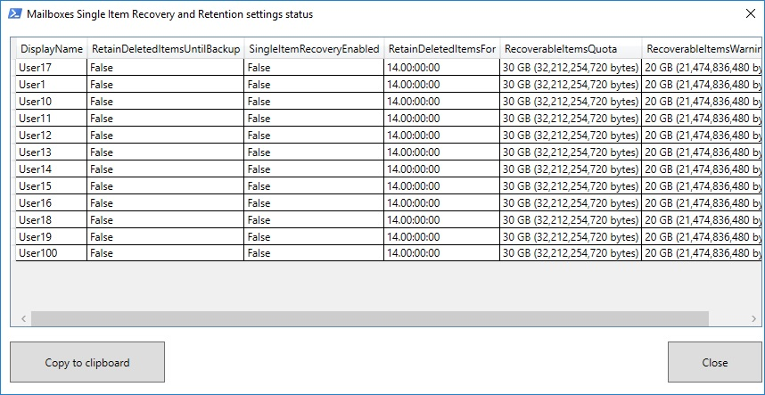
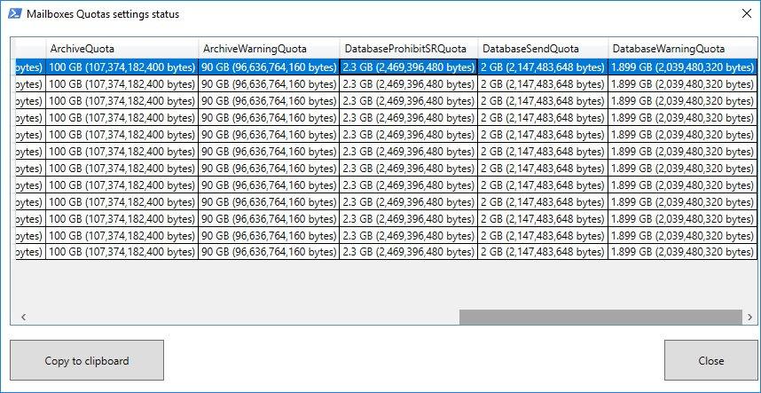
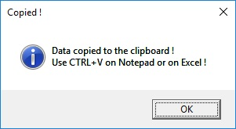

# Exchange-Get-Mailboxes-GUI
GUI to search mailboxes in an Exchange 2010, 2013, 2016, 2019 or Exchange Online (O365) environments

## Important notes
This powershell app requires Powershell V3, and also requires to be run from a PowerShell console with Exchange tools loaded, which can be an Exchange Management Shell window or a Powershell window from where you imported an Exchange session, see my TechNet blog post for a summary on how to do this (*right-click => Open in a new tab otherwise below sites will load instead of this page*):

* [How-to – Load Remote Exchange PowerShell Session on Exchange 2010, 2013, 2016, Exchange Online (O365) – which ports do you need](https://blogs.technet.microsoft.com/samdrey/2018/04/06/how-to-load-remote-powershell-session-on-exchange-2010-2013-2016-exchange-online-o365-2/)

* [Connect to Office 365 PowerShell](https://docs.microsoft.com/en-us/office365/enterprise/powershell/connect-to-office-365-powershell)

* [How To–Load Exchange Management Shell into PowerShell ISE](https://blogs.technet.microsoft.com/samdrey/2017/12/17/how-to-load-exchange-management-shell-into-powershell-ise-2/)

## Screenshots - because a picture is worth 1000 words...

### First window when launching the tool

### After a sample Get-Mailbox which name includes "user" string

### If you select "Unlimited" under the Resultsize (max number of mailboxes to search), or a number that is greater than 1000, you get a warning asking you if you want to continue

### Selecting mailboxes in the grid, notice the "Action on selected" button that becomes active

### Action : After selecting some mailboxes in the grid, calling the "List Mailbox Features" action in the drop-down list

### Action: Anoter action possible, calling the Single Item Recovery and mailbox dumpster limits for the selected mailboxes

### Action: List mailbox quotas, including database quota for each mailbox
*Note that mailbox quotas list include the Database info quota - that is useful when mailboxes are configure to use Mailbox Database Quotas*

### On most actions, you can copy the list in Windows clipboard (will be CSV Formatted) for further analyis, reporting or documentation about your mailboxes

### More to come...

