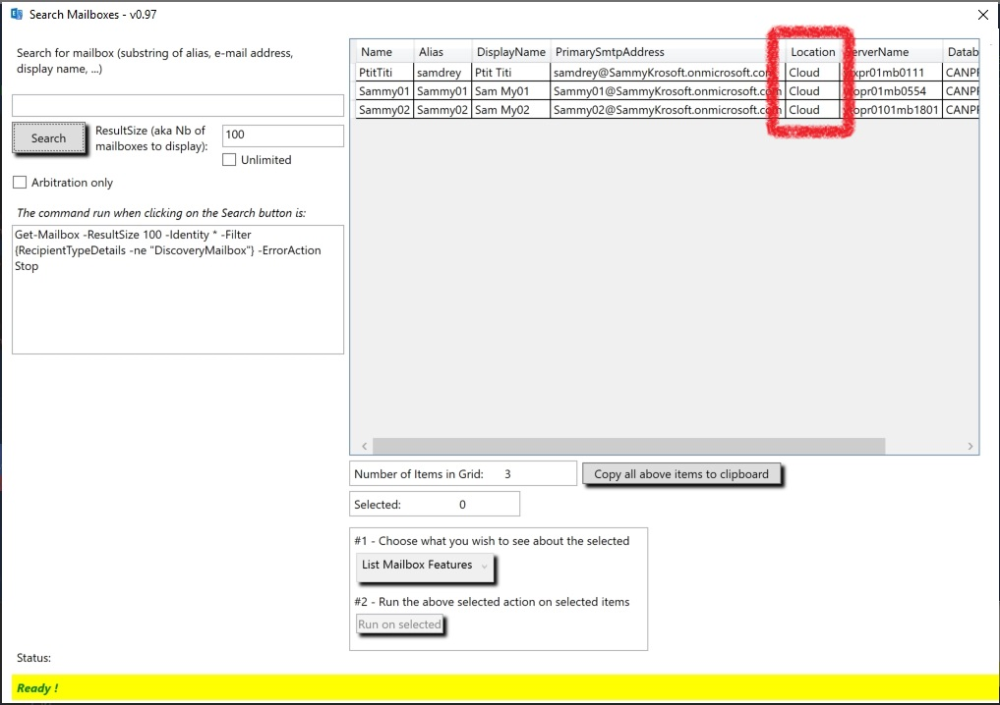
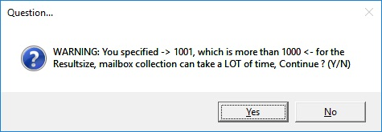
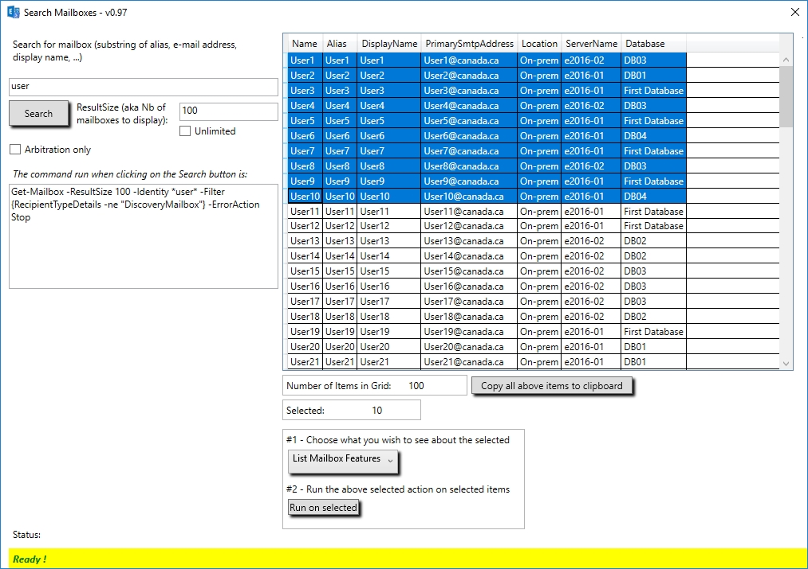
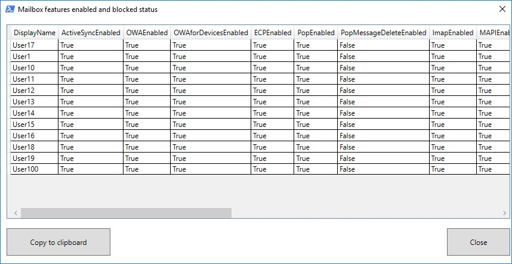

# Exchange-Get-Mailboxes-GUI
Here is a GUI to get mailboxes information in an Exchange 2010, 2013, 2016, 2019 and/or Exchange Online (O365) environments.

## Principle
For this GUI, I designed the interface using Windows Presentation Foundation, which is the next generation of Windows Forms, and which enables anyone to design Windows interfaces for underlying programs, to help users to get the most from computer programs.

Here's the principle used to create this Powershell application using WPF:
* First, I designed the Windows Presentation Foundation forms using Visual Studio 2017 Community Edition (which is free), and pasted the generated XAML code from Visual Studio 2007 into a PowerShell script - in this script I pasted directly the XAML code into a PowerShell "here-string", but you can load the XAML code from a separate file using Get-Content for example, that way if you want to change your Windows WPF form design, you just have to modify or paste the new code from Visual Studio directly into that separate file and leave your .ps1 script alone.
* then with a PowerShell code snippet I parsed the XAML code to get the form objects that PowerShell understands - buttons, check boxes, datagrids, labels, text blocks used as inputs as well as outputs sometimes (to put the PowerShell commands corresponding to the users input for example), and the form object itself, which is the container of all the other objects (buttons, checkboxes, etc...)
* and finally I wrote the functions behind the form that I want to run when the form loads, when we click the buttons, when we check or uncheck the checkboxes, when we change the text in text boxes, or when we select items from datagrids => for code to execute when the user interacts with Windows WPF forms, we must use the WPF form object's "events" (add_click, add_textChanged, add_loaded, add_closing, etc...) => you can retrieve Windows WPF form objects on the MSDN, or simply on Visual Studio 2017 when you design your form (switch from object properties to the object events to view all available events for a selected object)

It's pretty straightforward to write PowerShell WPF applications if we have in mind how to structure the program:

## Important notes
This powershell app requires Powershell V3, and also requires to be run from a PowerShell console with Exchange tools loaded, which can be an Exchange Management Shell window or a Powershell window from where you imported an Exchange session, see my TechNet blog post for a summary on how to do this (*right-click => Open in a new tab otherwise below sites will load instead of this page*):

* [How-to – Load Remote Exchange PowerShell Session on Exchange 2010, 2013, 2016, Exchange Online (O365) – which ports do you need](https://blogs.technet.microsoft.com/samdrey/2018/04/06/how-to-load-remote-powershell-session-on-exchange-2010-2013-2016-exchange-online-o365-2/)

* [Connect to Office 365 PowerShell](https://docs.microsoft.com/en-us/office365/enterprise/powershell/connect-to-office-365-powershell)

* [How To–Load Exchange Management Shell into PowerShell ISE](https://blogs.technet.microsoft.com/samdrey/2017/12/17/how-to-load-exchange-management-shell-into-powershell-ise-2/)

## Screenshots - because a picture is worth 1000 words...

### First window when launching the tool

### After a sample Get-Mailbox which name includes "user" string

Note that for cloud mailbox, the "Location" column will tell you that the mailbox is hosted in the cloud:

### If you select "Unlimited" under the Resultsize (max number of mailboxes to search), or a number that is greater than 1000, you get a warning asking you if you want to continue

### Selecting mailboxes in the grid, notice the "Action on selected" button that becomes active

### Action : After selecting some mailboxes in the grid, calling the "List Mailbox Features" action in the drop-down list

### Action: Anoter action possible, calling the Single Item Recovery and mailbox dumpster limits for the selected mailboxes

### Action: List mailbox quotas, including database quota for each mailbox
*Note that mailbox quotas list include the Database info quota - that is useful when mailboxes are configure to use Mailbox Database Quotas*

### On most actions, you can copy the list in Windows clipboard (will be CSV Formatted) for further analyis, reporting or documentation about your mailboxes

### More to come...

